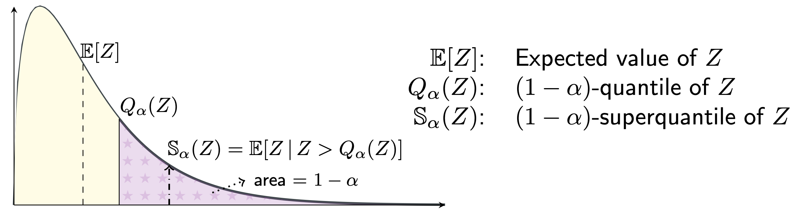

# SQwash: Distributionally Robust Learning in PyTorch with 1 Additional Line of Code

This package implements the [superquantile](https://en.wikipedia.org/wiki/Expected_shortfall)
a.k.a. Conditional Value at Risk (CVaR) for distributionally robust learning in PyTorch with GPU support.
The superquantile achieves distributional robustness by averaging over 
some fraction of the worst losses on the minibatch in each step, as illustrated in this figure:




For a demo of SQwash in action, please see [this colab](https://colab.research.google.com/drive/1GApiM0AsMb6Zw1O4dgL5iGRlWlsIaH6s?usp=sharing).

# Documentation
Please find the documentation [here](https://krishnap25.github.io/sqwash/).

# Installation
Once you have PyTorch >=1.7, you can grab SQwash from pip:
```bash
pip install sqwash
```
Alternatively, if you would like to edit the package, clone the repository, `cd` into the main directory of the repository and run
```bash
pip install -e .
```

The only dependency of SQwash is PyTorch, version 1.7 or higher.
See [here](https://pytorch.org/) for install instructions.

# Quick Start

As the name suggests, it requires only a one-line modification to the usual PyTorch training loops.
See the notebooks folder for [an example on CIFAR-10](notebooks/cifar10_example.ipynb).

```python
from sqwash import SuperquantileReducer
criterion = torch.nn.CrossEntropyLoss(reduction='none')  # Note: must set `reduction='none'`
reducer = SuperquantileReducer(superquantile_tail_fraction=0.5)  # define the reducer

# Training loop
for x, y in dataloader:
    y_hat = model(x)
    batch_losses = criterion(y_hat, y)  # shape: (batch_size,)
    loss = reducer(batch_losses)  # Additional line to use the superquantile reducer
    loss.backward()  # Proceed as usual from here
    ...
```

The package also gives a functional version of the reducers, similar to `torch.nn.functional`:
```python
import torch.nn.functional as F
from sqwash import reduce_superquantile

for x, y in dataloader:
    y_hat = model(x)
    batch_losses = F.cross_entropy(y_hat, y, reduction='none')  # must set `reduction='none'`
    loss = reduce_superquantile(batch_losses, superquantile_tail_fraction=0.5)  # Additional line
    loss.backward()  # Proceed as usual from here
    ...
```

The package can also be used for distributionally robust learning over 
pre-specified groups of data. Simply obtain a tensor of losses for each element of the batch and 
use the reducers in this pacakge as follows:
```python
loss_per_group = ...  # shape: (num_groups,)
reducer = reduce_superquantile(loss_per_group, superquantile_tail_fraction=0.6)
```

# Functionality
This package provides 3 reducers, which take a tensor of losses on a minibatch and reduce them to a single value. 
- `MeanReducer`: the usual reduction, which is equivalent to specifying `reduction='mean'` in your criterion.
- `SuperquantileReducer`: computes the superquantile/CVaR of the batch losses.
- `SuperquantileSmoothReducer`: computes a smooth counterpart of the superquantile/CVaR of the batch losses.

The reducers take in a batch of losses, so make sure you set the the flag `reduction='none'` in your criterion to get all the losses of your batch.

These reducers are also available via the functional interface, similar to `torch.nn.functional`:
- `reduce_mean`
- `reduce_superquantile`
- `reduce_superquantile_smooth`

## Setting the parameters
Both the `SuperquantileReducer` and the `SuperquantileSmoothReducer` take a parameter called the 
`superquantile_tail_fraction`. This fraction of the worst losses on a batch are taken by the reducer.
When `superquantile_tail_fraction` is taken to be 1, it is equivalent to taking the mean of the batch losses.
When `superquantile_tail_fraction` is 0, it is equivalent to the maximum of the batch losses. 
For typical applications, we find that values between 0.3 and 0.7 work reasonably. 
If it is smaller than 0.3, you end up throwing away most of the information in your batch, while 
values close to 1 are effectively equivalent to the mean. 

The `SuperquantileSmoothReducer` takes an additional argument `smoothing_parameter`,
which controls how smooth the resulting function is. The smoothing parameter is
internally scaled by the batch size due to theoretical considerations (see `qp_solve.py` for details).
The extreme regimes for the smoothing parameter are:
- `smoothing_parameter` is close to 0: we recover exactly the superquantile 
(i.e., the output of `SuperquantileReducer`), 
- `smoothing_parameter` is very large (tending to infinity): we recover the mean (the output of `MeanReducer`).

## Implementation Details
The `SuperquantileReducer` requires computing a quantile of the batch losses, which has a computational cost of `O(batch_size)`. One the other hand, the `SuperquantileSmoothReducer` requires solving a quadratic program. By using the special structure of this quadratic program, we can solve it algorithmically by just sorting a vector of size `2*batch_size`. The  algorithm also requires creating a matrix of shape `(2*batch_size, batch_size)`, which can be done very efficiently on the GPU with a < 2% increase in running time for moderate batch sizes.

# Authors
[Krishna Pillutla](krishnap25.github.io)  
[Yassine Laguel](https://yassine-laguel.github.io)  
[Jérôme Malick](https://ljk.imag.fr/membres/Jerome.Malick/)  
[Zaid Harchaoui](http://faculty.washington.edu/zaid/)  

# License
SQwash is available under the GPLv3 license. Please see the [license](LICENSE) for details.

# Citation
If you found this package useful, please cite the following paper
```
@article{sfl_mlj_2023,
title = {Federated Learning with Superquantile Aggregation for Heterogeneous Data},
author={Pillutla, Krishna and Laguel, Yassine and Malick, J{\'{e}}r{\^{o}}me and Harchaoui, Zaid},
journal   = {Mach. Learn.},
year = {2023},
publisher={Springer}
}

@inproceedings{DBLP:conf/ciss/LPMH21,
  author    = {Yassine Laguel and
               Krishna Pillutla and
               J{\'{e}}r{\^{o}}me Malick and
               Zaid Harchaoui},
  title     = {{A Superquantile Approach to Federated Learning with Heterogeneous
               Devices}},
  booktitle = {55th Annual Conference on Information Sciences and Systems, {CISS}
               2021, Baltimore, MD, USA, March 24-26, 2021},
  pages     = {1--6},
  publisher = {{IEEE}},
  year      = {2021},
}
```

# Acknowledgements 
We acknowledge support from NSF DMS 2023166,
DMS 1839371, CCF 2019844, the CIFAR program "Learning
in Machines and Brains", faculty research awards, and a JP
Morgan PhD fellowship. This work has been partially supported
by MIAI – Grenoble Alpes, (ANR-19-P3IA-0003).
